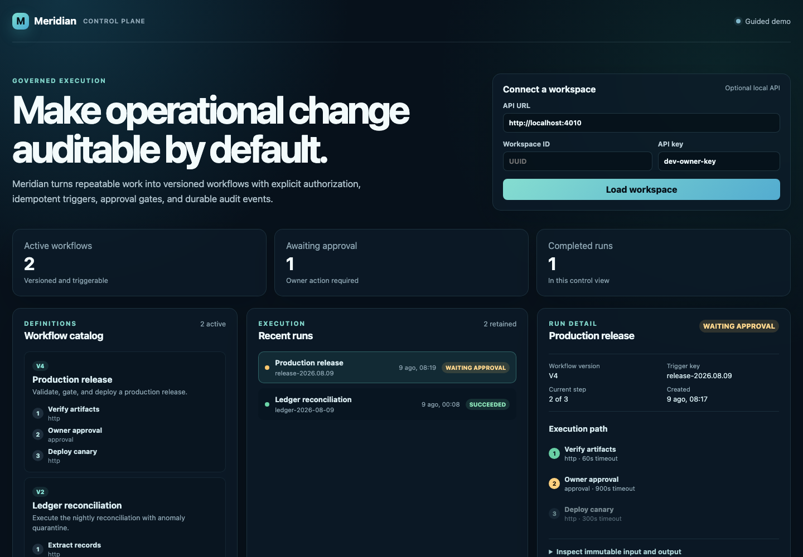

# Meridian Control Plane

Meridian is a reference implementation for governing operational
workflows. It couples a React control console with a multi-tenant API, a
separate polling worker, durable local persistence, a PostgreSQL production
schema, role checks, idempotent triggers, approval gates, audit events, and a
transactional-outbox-shaped event model.

The product path and the operational mechanics behind it are both explicit.

## What is in the monorepo

| Area | Responsibility |
| --- | --- |
| apps/api | Fastify API, request validation, API-key actors, RBAC enforcement |
| apps/worker | Isolated process that invokes bounded workflow ticks |
| apps/web | React control console with demo and live-API modes |
| packages/contracts | Shared domain/transport contracts |
| packages/core | Workflow state machine, audit semantics, idempotency |
| packages/database | Durable SQLite adapter and a PostgreSQL RLS migration |

## Core guarantees

- Workspace members have owner, editor, or viewer capabilities.
- A run is idempotent per workspace, workflow, and client trigger key.
- Only active workflows can be triggered.
- Approval steps pause a run until an owner acts.
- Every material state change appends an audit event.
- Each trigger, approval, and terminal result emits an outbox event.
- Input validation and bounded body sizes occur at the HTTP edge.

## Quick start

Requires Node.js 22+ and npm 10+.

    npm ci
    npm run check

Run the services in separate terminals:

    npm run dev:api
    npm run dev:worker
    npm run dev:web

The web console starts in guided-demo mode. To connect it to the API, create a
workspace with the local owner key and paste the returned workspace id into the
console:

    curl -X POST http://localhost:4010/v1/workspaces \
      -H 'content-type: application/json' \
      -H 'x-api-key: dev-owner-key' \
      -d '{"slug":"acme-ops","name":"Acme Operations"}'

The development keys are intentionally insecure examples. Configure
MERIDIAN_API_KEYS_JSON and MERIDIAN_WORKER_TOKEN before exposing any endpoint.

## Verification

    npm run check

The gate builds every workspace, runs core, database, API, and worker tests,
executes the web interface test, then type-checks each package. CI runs the
same command from a clean checkout.

## Containerized local stack

    docker compose up --build

The API persists to a named local volume. The worker connects to the API only
through its internal tick endpoint, and the web app is served by unprivileged
Nginx on http://localhost:8080.

## Architecture

    React console
         |
         v
    API boundary -- validates API key and workspace role
         |
         v
    Core workflow service -- audit + outbox + state machine
         |                              |
         v                              v
    SQLite adapter                 worker tick client
         |
         +-- PostgreSQL schema and RLS migration for scaled deployment

Read [docs/architecture.md](docs/architecture.md) for lifecycle and tenancy
details, and [docs/runbook.md](docs/runbook.md) for a complete API exercise.

## Deliberate boundaries

The included SQLite adapter is fully functional for a single-node deployment.
The PostgreSQL migration captures the production tenancy and outbox data model,
but a distributed PostgreSQL adapter, OIDC identity provider, secret manager,
and broker-backed outbox relay remain integration work rather than false claims
of completion.
